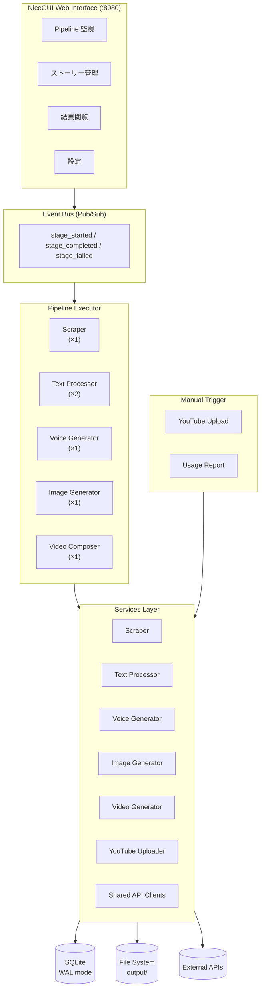
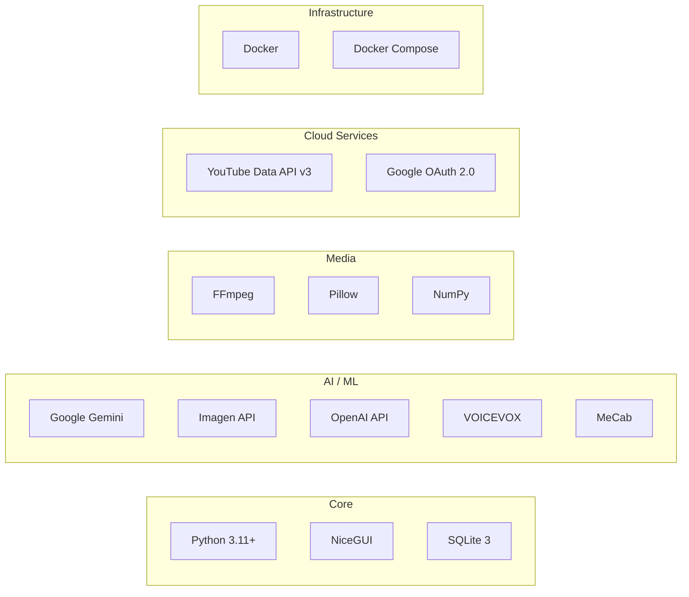
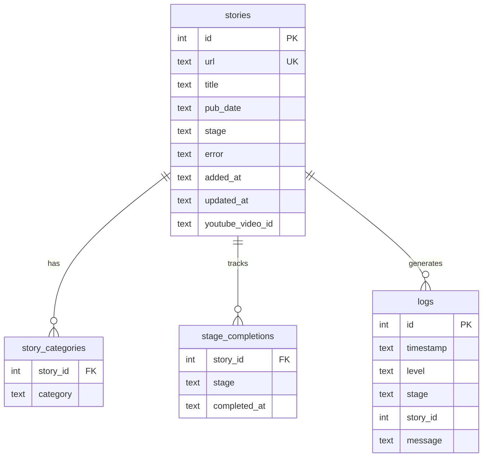

# Kaidan Video Generator


怪談ストーリーから動画を自動生成し、YouTubeへアップロードするパイプラインシステム。

ストーリーのスクレイピングからテキスト処理、音声合成、画像生成、動画合成、YouTube投稿、利用報告までを一気通貫で自動化する。

## システムアーキテクチャ



## パイプラインの処理フロー

各ストーリーは以下のステージを順に通過する。各ステージは冪等で、失敗時はリトライ可能。


| ステージ | 処理内容 | 並行数 |
|----------|----------|--------|
| **Scrape** | HHSライブラリからストーリーHTMLを取得し、テキスト抽出 | 1 |
| **Text Processing** | LLM（Gemini/OpenAI）で漢字→ひらがな変換、MeCabで助詞補正、チャンク分割 | 2 |
| **Voice Generation** | VOICEVOXで各チャンクをWAV音声に変換し、1本のナレーションに結合 | 1 |
| **Image Generation** | LLMでプロンプト抽出 → Imagen APIで画像生成 → VHSフィルタ適用 | 1 |
| **Video Composition** | FFmpegでスライドショー作成、BGM合成、OP/ED結合 → 最終MP4出力 | 1 |
| **YouTube Upload** | OAuth 2.0認証でYouTube Data APIにアップロード（手動トリガー） | - |
| **Usage Report** | HHSライブラリへ利用報告フォームを自動送信（手動トリガー） | - |

## 技術スタック



## 工夫している点

### パイプライン設計

- **ステージごとの並行数制御** — API呼び出しが重いステージ（画像・音声・動画）は並行数1、軽量なテキスト処理は並行数2に設定し、リソースの競合を防止
- **ポーリングベースのワーカー** — 各ステージが5秒間隔でDBをポーリングし、待機中のタスクを取得。シンプルかつ堅牢
- **冪等なステージ遷移** — 各ステージの完了はDB上でアトミックに記録。中断・再起動しても安全にリジュームできる
- **EventBusによるリアルタイムUI更新** — スレッドセーフなPub/Subでパイプラインの状態変化をUIへ即座に反映

### データアクセス最適化

- **SQLite WALモード** — 複数のリーダーとライターが同時にアクセス可能
- **スレッドローカルDB接続** — ワーカースレッドごとに独立した接続を保持し、SQLiteのスレッド制約に対応
- **N+1クエリの排除** — カテゴリとステージ完了情報をバッチクエリで一括取得
- **ffprobe結果のキャッシュ** — 高コストなメディア情報取得を結果キャッシュで高速化

### テキスト処理

- **MeCabによる助詞補正** — 「は」（助詞）→「わ」、「へ」（助詞）→「え」に変換し、VOICEVOXでの正確な発音を実現
- **LLM出力の繰り返し検出** — 8文字以上の同一パターンが3回以上連続する場合を自動検出・除去
- **文境界を考慮したチャンク分割** — 句点（。！？）を優先的に分割点として選択し、自然な区切りを維持

### 画像・動画

- **VHS劣化フィルタ** — ピクセレーション、彩度低下、ナイトビジョン色味、ノイズ、走査線、水平歪み、ビネットを組み合わせた「見つかった映像」風の演出。NumPyのベクトル演算で高速処理
- **可変フレーム長スライドショー** — 画像ごとに表示時間を個別設定可能。ナレーション音声と同期
- **音量正規化** — FFmpegの`loudnorm`フィルタで音量を統一してからBGMと合成

### エラーハンドリング・信頼性

- **指数バックオフリトライ** — HTTP通信・API呼び出しに自動リトライ（最大3回、最大60秒待機）
- **レジュマブルYouTubeアップロード** — 1MBチャンクでストリーミングアップロード。中断時も再開可能
- **アップロード重複防止** — `youtube_video_id`が既に存在する場合はスキップ
- **スクレイパーの礼儀正しさ** — リクエスト間に2秒のディレイを挿入

### APIクライアント管理

- **遅延初期化 + グローバルキャッシュ** — APIクライアントを初回使用時にのみ生成し、モジュールレベルでキャッシュ
- **テスト用リセット機構** — `reset_all()`で全クライアントをクリア可能

## データベーススキーマ



## ディレクトリ構成

```
app/
├── main.py                 # エントリポイント
├── config.py               # 設定管理（TOML, デフォルト値マージ）
├── database.py             # SQLiteアクセス層
├── models.py               # データモデル（Story）
├── pipeline/
│   ├── executor.py         # ステージ実行エンジン
│   ├── stages.py           # ステージ定義・ワーカー処理
│   ├── events.py           # EventBus（Pub/Sub）
│   └── retry.py            # リトライデコレータ
├── services/
│   ├── scraper.py          # Webスクレイピング
│   ├── text_processor.py   # テキスト処理（LLM + MeCab）
│   ├── voice_generator.py  # VOICEVOX音声合成
│   ├── image_generator.py  # 画像生成（Gemini/Imagen）
│   ├── video_generator.py  # FFmpeg動画合成
│   ├── youtube_uploader.py # YouTubeアップロード
│   └── clients.py          # 共有APIクライアント
├── ui/
│   ├── layout.py           # 共通レイアウト
│   ├── url_state.py        # URLステート管理
│   └── pages/              # Pipeline, Stories, Results, Settings
└── utils/
    ├── ffmpeg.py            # FFmpegラッパー
    ├── paths.py             # パス管理
    └── log.py               # ログ設定
```

## セットアップ

### 環境変数

```bash
GEMINI_API_KEY=...                    # Gemini API キー
# または個別に指定:
# GEMINI_API_KEY_TEXT_TO_TEXT=...
# GEMINI_API_KEY_TEXT_TO_IMAGE=...
YOUTUBE_CLIENT_SECRET_PATH=...        # OAuth認証情報ファイルパス
VOICEVOX_HOST=http://localhost:50021  # VOICEVOX エンドポイント
```

### ローカル開発

```bash
pip install -r requirements.txt
python -m app.main
# http://localhost:8080 でアクセス
```

### Docker

```bash
docker compose up
# VOICEVOX: :50021 / App: :8080
```

## テスト

```bash
pytest
```

テスト対象: URLステート管理、リトライロジック、EventBus、テキストチャンク分割、パス生成、設定読み込み、データモデル等。

## ライセンス

本プロジェクトのライセンスについてはリポジトリオーナーにお問い合わせください。
