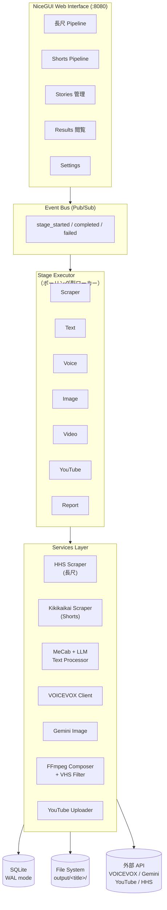
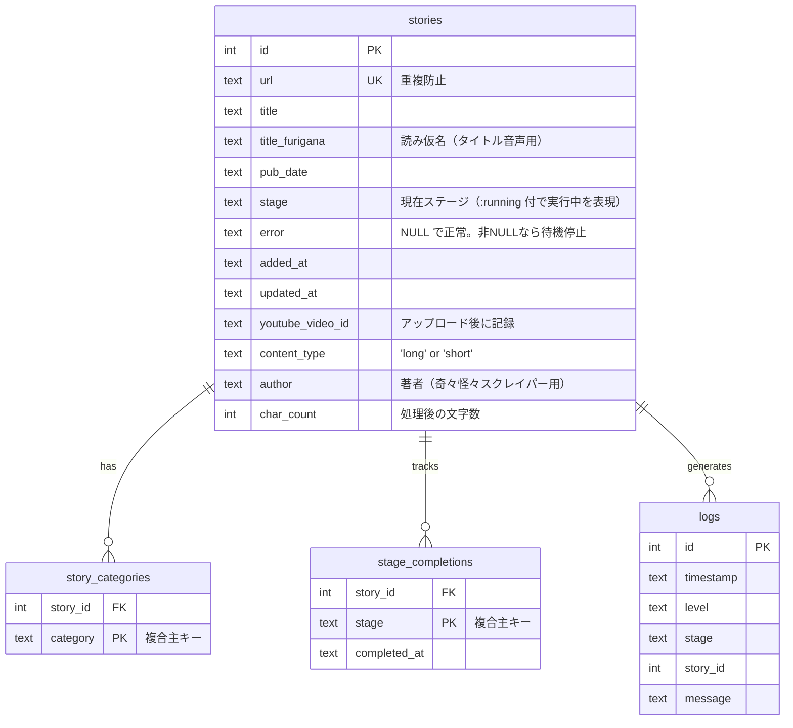

# Kaidan Video Generator


怪談ストーリーから動画を自動生成し、YouTube へアップロードするパイプラインシステム。

Web からのストーリー取得 → テキスト処理（ひらがな変換・チャンク分割）→ VOICEVOX 音声合成 → Gemini 画像生成 → FFmpeg 動画合成 → YouTube 投稿 → 利用報告までを一気通貫で自動化する。**長尺動画** と **YouTube Shorts** の 2 系統を同じパイプライン基盤で運用している。

## 目次

- [システムアーキテクチャ](#システムアーキテクチャ)
- [パイプライン処理フロー](#パイプライン処理フロー)
- [データベース](#データベース)
- [工夫している点](#工夫している点)
- [ディレクトリ構成](#ディレクトリ構成)
- [セットアップ](#セットアップ)

## システムアーキテクチャ



### 構成要素

| レイヤ | 役割 |
| --- | --- |
| **NiceGUI UI** | パイプライン監視、ストーリー管理、設定編集、結果プレビュー |
| **Event Bus** | ワーカー → UI へのスレッドセーフな Pub/Sub |
| **Stage Executor** | 各ステージを `ThreadPoolExecutor` で並列実行。DB をポーリングして入力待ちを検出 |
| **Services** | スクレイピング／テキスト／音声／画像／動画／YouTube の各ドメインロジック |
| **SQLite (WAL)** | ストーリー状態、ステージ完了履歴、カテゴリ、ログを永続化 |
| **File System** | 生成物（raw テキスト、チャンク JSON、音声、画像、最終動画）を `output/<title>/` に保存 |

## パイプライン処理フロー

長尺とShortsで**ステージ遷移は共通**だが、Shorts では `report_submitted` が無く、パラメータ（話速・画像比率・シーン数）が別系統で設定される。


| ステージ | 処理内容 | 保存先 |
| --- | --- | --- |
| **Scrape** | HHS Library / 奇々怪々 からタイトル・本文・著者・カテゴリ等を取得 | `raw_content.txt` |
| **Text** | MeCab で漢字→ひらがな変換＋助詞補正、LLM フォールバック、チャンク分割 | `processed_text.txt`, `chunks.json` |
| **Voice** | VOICEVOX で各チャンクを WAV 化 → 結合。タイトル音声も別途生成 | `audio/narration.wav` |
| **Image** | Gemini でシーンプロンプト抽出 → `gemini-2.5-flash-image` で画像生成 → VHS フィルタ | `images/scene_*.png` |
| **Video** | FFmpeg でスライドショー＋ナレーション＋BGM 合成、タイトルカード／エンドスクリーン付与 | `video.mp4` |
| **YouTube** | OAuth2 で YouTube Data API にアップロード、スケジュール投稿、固定コメント設定 | `youtube_video_id` を DB 記録 |
| **Report** | HHS Library へ利用報告フォームを自動送信（長尺のみ） | — |

### 状態遷移の詳細

各ストーリーは DB の `stage` カラムを持ち、ワーカーが**入力待ちのストーリー**（前段の完了状態）を 1 件取り出して処理する。

```mermaid
stateDiagram-v2
    [*] --> pending: URL 登録
    pending --> "scraped:running": worker picks up
    "scraped:running" --> scraped: 成功
    "scraped:running" --> pending: 失敗（error セット）
    scraped --> "text_processed:running"
    "text_processed:running" --> text_processed
    text_processed --> "voice_generated:running"
    voice_generated --> images_generated
    images_generated --> video_complete
    video_complete --> youtube_uploaded
    youtube_uploaded --> report_submitted: 長尺のみ
    report_submitted --> [*]
```

- `:running` サフィックスで実行中を表現。クラッシュ時は `recover_running()` で前段に戻して再開可能
- `error` カラムが非 NULL の間はワーカーが拾わない（無限リトライ抑止）
- UI の「リトライ」操作で `error` をクリアすれば再実行される

## データベース

**SQLite 単一ファイル**（`data/kaidan.db`）で管理。WAL モード＋スレッドローカル接続で並行アクセスを実現している。

### ER 図



### テーブル詳細

#### `stories` — ストーリーの中心テーブル

| カラム | 型 | 用途 |
| --- | --- | --- |
| `id` | INTEGER PK | 自動採番 |
| `url` | TEXT UNIQUE | 元記事URL。重複投入を防止 |
| `title` / `title_furigana` | TEXT | 表示用タイトル＋VOICEVOX 読み上げ用ふりがな |
| `pub_date` | TEXT | 原文の掲載日 |
| `stage` | TEXT | `pending` / `scraped` / ... / `report_submitted`（＋`:running`） |
| `error` | TEXT | エラーメッセージ。非 NULL の間は再キューされない |
| `added_at` / `updated_at` | TEXT (ISO 8601) | タイムスタンプ |
| `youtube_video_id` | TEXT | 投稿後に記録。再アップロード抑止 |
| `content_type` | TEXT | `long` / `short` でパイプラインを分岐 |
| `author` | TEXT | 原作者（奇々怪々など） |
| `char_count` | INTEGER | テキスト処理後の文字数。ワーカーの優先度ソートに使用（短いもの優先） |

**インデックス**: `idx_stage`, `idx_url`, `idx_content_type`, `idx_content_type_stage`

#### `story_categories` — カテゴリの多対多

1 ストーリーに複数カテゴリ（「実話怪談」「心霊」など）を紐付け。`(story_id, category)` が複合主キー。

#### `stage_completions` — ステージ完了の監査ログ

「どのストーリーが、どのステージを、いつ完了したか」を記録。再実行時は該当行を削除してから進める。

#### `logs` — 診断ログ

パイプライン実行中の詳細ログを保存。UI でステージ／ストーリー単位でフィルタ表示。

### DB 運用ポイント

- **スキーママイグレーション** — 起動時に `ALTER TABLE ... ADD COLUMN` を try/except で実行し、新カラム追加を冪等化（`title_furigana`, `content_type`, `author`, `char_count`, `youtube_video_id`）
- **スレッドローカル接続** — `threading.local()` で接続を各スレッドに割り当て。SQLite のスレッド制約を回避
- **WAL モード** — 複数ワーカーの同時読み書きに対応
- **N+1 回避** — 一覧取得時に `story_categories` と `stage_completions` をバッチクエリで一括ロード
- **優先度付きキュー** — `get_stories_at_stage()` は `char_count ASC` でソートし、短いストーリーを優先処理

## 工夫している点

### パイプライン設計

- **ステージごとの並行数制御** — API コールが重いステージ（画像・音声・動画）は 1 並列、軽量なテキスト処理は 2 並列
- **ポーリング型ワーカー** — 各ステージが一定間隔で DB をポーリングし、待機中のタスクを取得。シンプルかつ堅牢
- **冪等なステージ遷移** — 完了時に `stage_completions` に記録。クラッシュ→再起動でも整合性を保ってリジューム
- **EventBus によるリアルタイム UI** — スレッドセーフな Pub/Sub でステージ状態を UI に即反映

### テキスト処理（決定論優先）

- **MeCab + unidic-lite で助詞補正** — 「は」（助詞）→「わ」、「へ」→「え」など、ルール化できる変換は形態素解析ベースで確実に実施
- **LLM はフォールバック** — MeCab で読めない固有名詞などは Gemini に委譲
- **繰り返し検出** — LLM 出力の「8文字以上のパターンが 3 回以上連続」を検知して除去
- **文境界を考慮したチャンク分割** — 句点（。！？）を優先的に分割点に選び、自然な区切りを維持

### 画像・動画

- **VHS 劣化フィルタ** — ピクセレーション／彩度低下／ナイトビジョン色味／ノイズ／走査線／水平歪み／ビネットを組み合わせた「見つかった映像」風演出。NumPy のベクトル演算で高速処理
- **可変フレーム長スライドショー** — 画像ごとに表示時間を設定可能。ナレーション音声と同期
- **音量正規化** — FFmpeg `loudnorm` で音量を揃えてから BGM と合成
- **Shorts 専用パラメータ** — 9:16 画像、話速 1.15x、シーン数少なめ、VHS 任意、エンドスクリーン付与

### エラーハンドリング・信頼性

- **指数バックオフリトライ** — HTTP／API 呼び出しに自動リトライ（最大 3 回、最大 60 秒待機）
- **レジュマブル YouTube アップロード** — 1MB チャンクで送信。中断しても再開可能
- **アップロード重複防止** — `youtube_video_id` 既存時はスキップ
- **スクレイパーの礼儀** — リクエスト間に 2 秒ディレイ

### API クライアント管理

- **遅延初期化 + モジュールキャッシュ** — 初回使用時にのみクライアント生成、以降は再利用
- **テスト用リセット機構** — `reset_all()` で全クライアントをクリア

## ディレクトリ構成

| パス | 説明 |
| --- | --- |
| [app/main.py](app/main.py) | NiceGUI + FastAPI エントリポイント |
| [app/config.py](app/config.py) | TOML ベース設定管理（140+ パラメータ） |
| [app/database.py](app/database.py) | SQLite アクセス層 |
| [app/models.py](app/models.py) | `Story` dataclass、`STAGES` / `STAGES_SHORT` |
| **[app/pipeline/](app/pipeline/)** | |
| [app/pipeline/executor.py](app/pipeline/executor.py) | ステージ実行エンジン（ThreadPoolExecutor） |
| [app/pipeline/stages.py](app/pipeline/stages.py) | 各ステージのワーカー関数（長尺・Shorts 両対応） |
| [app/pipeline/events.py](app/pipeline/events.py) | EventBus (Pub/Sub) |
| [app/pipeline/retry.py](app/pipeline/retry.py) | 指数バックオフデコレータ |
| **[app/services/](app/services/)** | |
| [app/services/scraper.py](app/services/scraper.py) | HHS Library スクレイパー |
| [app/services/kikikaikai_scraper.py](app/services/kikikaikai_scraper.py) | 奇々怪々 スクレイパー（Shorts 用） |
| [app/services/text_processor.py](app/services/text_processor.py) | MeCab + LLM ひらがな変換・チャンク分割 |
| [app/services/voice_generator.py](app/services/voice_generator.py) | VOICEVOX 音声合成 |
| [app/services/image_generator.py](app/services/image_generator.py) | Gemini 画像生成 + VHS フィルタ |
| [app/services/video_generator.py](app/services/video_generator.py) | FFmpeg 動画合成 |
| [app/services/youtube_uploader.py](app/services/youtube_uploader.py) | YouTube Data API アップロード |
| [app/services/clients.py](app/services/clients.py) | 共有 API クライアント |
| **[app/ui/pages/](app/ui/pages/)** | |
| [app/ui/pages/pipeline.py](app/ui/pages/pipeline.py) | 長尺パイプライン監視 UI |
| [app/ui/pages/shorts_pipeline.py](app/ui/pages/shorts_pipeline.py) | Shorts パイプライン監視 UI |
| [app/ui/pages/stories.py](app/ui/pages/stories.py) / [shorts_stories.py](app/ui/pages/shorts_stories.py) | ストーリー一覧・管理 |
| [app/ui/pages/results.py](app/ui/pages/results.py) | 生成結果プレビュー・メタ編集 |
| [app/ui/pages/settings.py](app/ui/pages/settings.py) | 設定画面・YouTube OAuth |
| **[app/utils/](app/utils/)** | FFmpeg ラッパー、パス管理、ログ |
| [data/](data/) | `kaidan.db`、`config.toml`（実行時生成） |
| [assets/](assets/) | BGM・オープニング・エンディング素材 |
| [output/](output/) | ストーリーごとの生成物（`output/<title>/`） |
| [tests/](tests/) | pytest スイート |

## セットアップ

### 環境変数（`.env`）

```bash
GEMINI_API_KEY=...                    # Gemini API キー（テキスト・画像兼用）
# 個別指定も可:
# GEMINI_API_KEY_TEXT_TO_TEXT=...
# GEMINI_API_KEY_TEXT_TO_IMAGE=...
OPENAI_API_KEY=...                    # フォールバック用（任意）
YOUTUBE_CLIENT_SECRET_PATH=...        # OAuth クライアント情報 JSON
VOICEVOX_HOST=http://localhost:50021  # VOICEVOX エンドポイント
```

### Docker（推奨）

```bash
docker compose up --build -d
# VOICEVOX :50021 / App :8080
```

> **重要**: Python コード・設定を変更したら **必ず** `docker compose up --build -d` で再ビルドすること。ローカル編集だけではコンテナに反映されない。

### ローカル開発

```bash
pip install -r requirements.txt
python -m app.main
# http://localhost:8080
```

### テスト

```bash
pytest
```

## ライセンス

本プロジェクトのライセンスについてはリポジトリオーナーにお問い合わせください。
